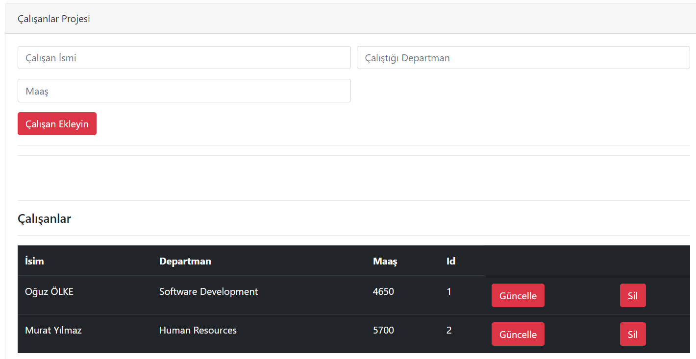

# Employees_Project_FakeRestApi
This Employees Project uses ES6+ features,Json Server,Webpack and Webpack-Dev-Server.

# How To Run This Project ?

```
npm install

json-server --watch fake-api/employee.json

npm start
```

## What's Done In The Project
**Dom events(click, submit, input, DOMContentLoaded) and rest api request(get, post, delete, put) were used.**


## Project ScreenShot :point_down:


